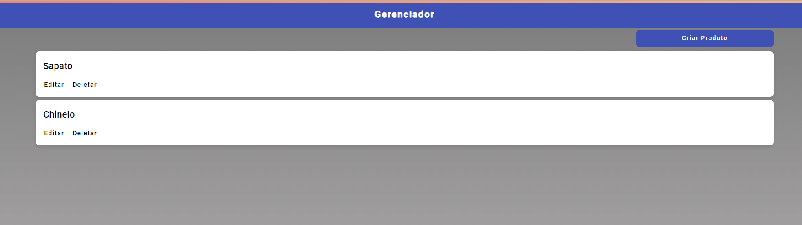

# 🚀 Meu Projeto Angular

Bem-vindo ao **Meu Projeto Angular**! Este projeto é uma aplicação web desenvolvida com Angular. Siga as instruções abaixo para configurar e iniciar o projeto.

## 📋 Pré-requisitos

Antes de começar, certifique-se de ter as seguintes ferramentas instaladas em sua máquina:

- [Node.js](https://nodejs.org/) (versão 14 ou superior)
- [npm](https://www.npmjs.com/) (geralmente instalado junto com o Node.js)
- [Angular CLI](https://angular.io/cli) (opcional, mas recomendado)

## 🛠️ Instalação e Configuração

1. **Clone o repositório** e **navegue até o diretório do projeto**:

   ```bash
   git clone https://github.com/bruno-santos-martins/manager-product-crud.git
   cd manager-product-crud
   ```

2. **Instale as dependências:**

   ```bash
   npm install
   ```

3. **Instale as dependências:**

   ```bash
   npm install
   ```
4. **Inicie o servidor do banco de dados:**

   ```bash
   npx json-server db.json
   ```

5. **Inicie o servidor de desenvolvimento:**

   ```bash
   npm start
   

## Build

Run `ng build` to build the project. The build artifacts will be stored in the `dist/` directory.

## Running unit tests

Run `ng test` to execute the unit tests via [Karma](https://karma-runner.github.io).

